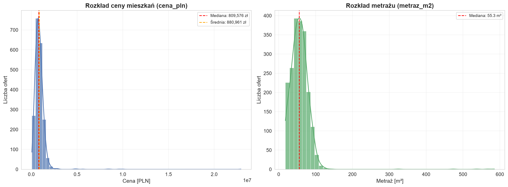
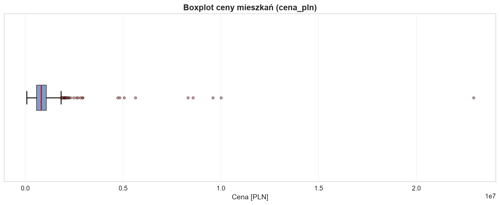
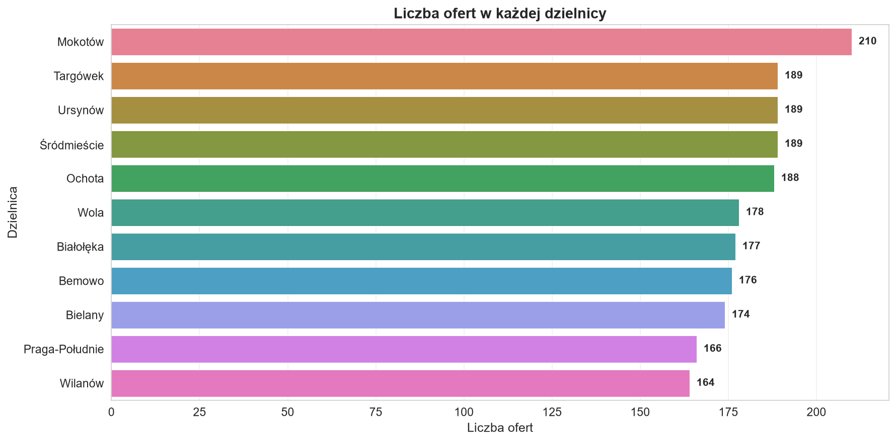
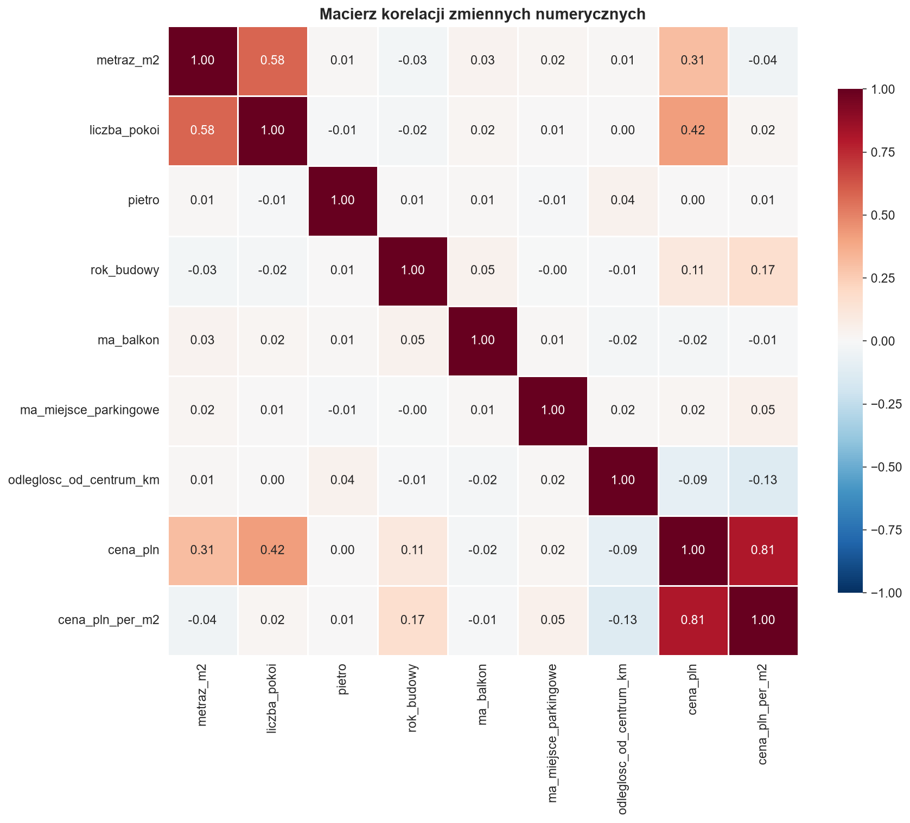
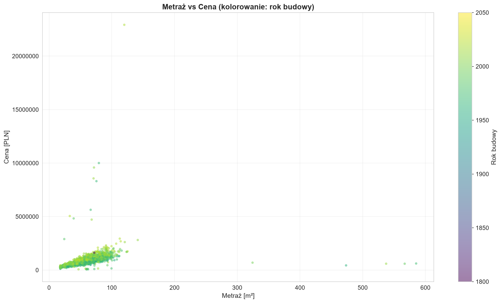
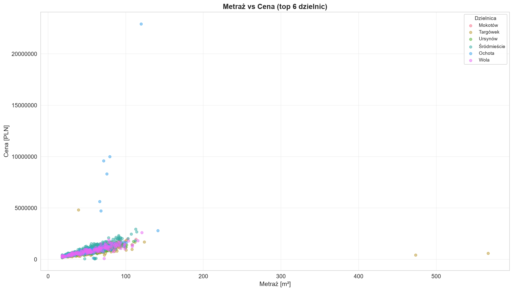
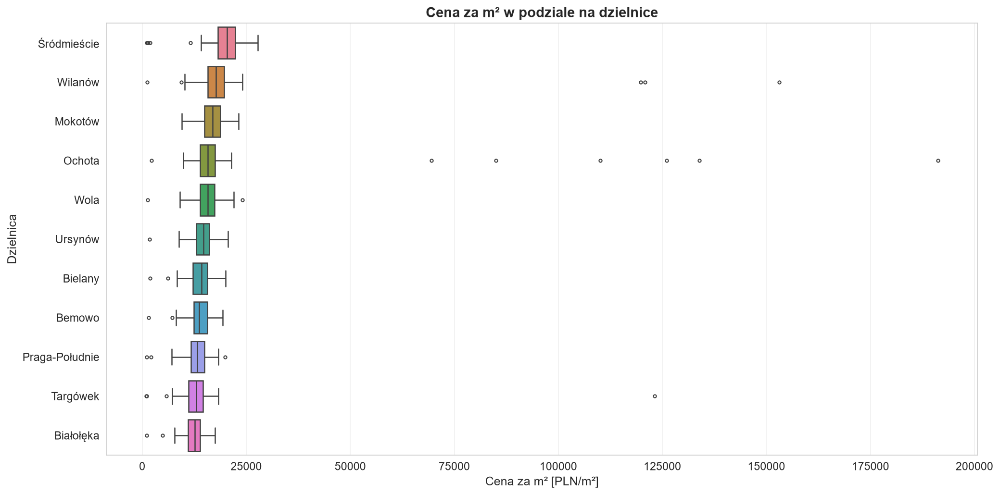
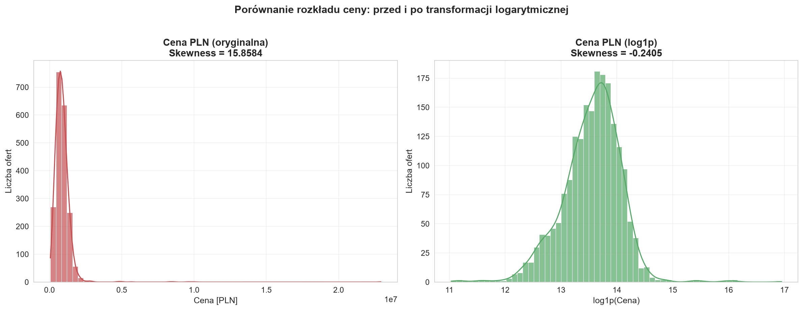

# Raport z Analizy Rynku Mieszkań w Warszawie

Raport przedstawia wyniki automatycznej eksploracyjnej analizy danych (EDA) rynku nieruchomości w Warszawie, wykonanej za pomocą skryptów wchodzących w skład aplikacji.

---

## 📂 Struktura Projektu

Aplikacja została podzielona na logiczne foldery o angielskich nazwach, co zapewnia profesjonalną strukturę repozytorium:

- **`App/`** – Moduły źródłowe aplikacji:
  - [`apartment_analysis.py`](file:///c:/Users/Amelka%20i%20Zuzia/Desktop/BigData/App/apartment_analysis.py) – Główny skrypt koordynujący przebieg analizy.
  - [`data_processing.py`](file:///c:/Users/Amelka%20i%20Zuzia/Desktop/BigData/App/data_processing.py) – Klasy/funkcje do ładowania, czyszczenia i obliczeń statystycznych.
  - [`visualization.py`](file:///c:/Users/Amelka%20i%20Zuzia/Desktop/BigData/App/visualization.py) – Funkcje odpowiedzialne za stylizację i generowanie wykresów.
- **`Data/`** – Zbiory danych:
  - [`warsaw_apartments.csv`](file:///c:/Users/Amelka%20i%20Zuzia/Desktop/BigData/Data/warsaw_apartments.csv) – Główny plik z danymi ofertowymi.
- **`GenData/`** – Skrypty pomocnicze:
  - [`generate_data.py`](file:///c:/Users/Amelka%20i%20Zuzia/Desktop/BigData/GenData/generate_data.py) – Skrypt do generowania syntetycznych danych ofertowych.
- **`Plots/`** – Katalog z wygenerowanymi wizualizacjami w formacie PNG.

---

## 🖥️ Konsolowy Zapis Działania Programu

Poniżej znajduje się pełny log z konsoli wygenerowany podczas uruchomienia polecenia `py App/apartment_analysis.py`:

```text
======================================================================
  CZESC 1 - WSTEPNA EKSPLORACJA
======================================================================

Shape: (2000, 10)
   -> 2000 wierszy (ofert), 10 kolumn (cech)

Info:
--------------------------------------------------
id_oferty                    int64
dzielnica                      str
metraz_m2                  float64
liczba_pokoi                 int64
pietro                       int64
rok_budowy                   int64
ma_balkon                     bool
ma_miejsce_parkingowe         bool
odleglosc_od_centrum_km    float64
cena_pln                   float64

Memory usage: 250.7 KB

Brakujace wartosci (isnull().sum()):
--------------------------------------------------
id_oferty                  0
dzielnica                  0
metraz_m2                  0
liczba_pokoi               0
pietro                     0
rok_budowy                 0
ma_balkon                  0
ma_miejsce_parkingowe      0
odleglosc_od_centrum_km    0
cena_pln                   0

-> Suma brakow: 0

======================================================================
KOMENTARZ - ANALIZA DIAGNOSTYCZNA:
======================================================================
Na podstawie statystyk opisowych widoczne sa nastepujace anomalie:

1. METRAZ (metraz_m2):
   - max = 585.2 m2 - to wartosc znacznie przekraczajaca typowy metraz
     mieszkania (nawet luksusowego). Normalne mieszkania w Warszawie maja
     18-180 m2. Wartosci powyzej 300 m2 wskazuja na bledy w danych.

2. ROK BUDOWY (rok_budowy):
   - min = 1800 - budynki z XIX wieku sa skrajnie nieprawdopodobne jako
     oferty sprzedazy nowoczesnych mieszkan.
   - max = 2050 - rok w przyszlosci, co jest oczywistym bledem.

3. CENA (cena_pln):
   - Ogromna rozpietosc: min = 61,776 zl, max = 22,923,902 zl.
   - Odchylenie standardowe (749,976 zl) jest bardzo wysokie w stosunku
     do sredniej (880,961 zl), co sugeruje outliery.
   - Niektore ceny ponizej 50 000 zl sa nierealistyczne dla Warszawy,
     a ceny powyzej 10 000 000 zl wskazuja na penthousy lub bledy.


======================================================================
  CZESC 2 - STATYSTYKI OPISOWE
======================================================================

Statystyki kolumny cena_pln:
--------------------------------------------------
  Srednia:                      880,961 zl
  Mediana:                      809,576 zl
  Odchylenie std:               749,976 zl
  Skewness (skosnosc):          15.8584
  Kurtosis (kurtoza):          404.2183

KOMENTARZ - Skosnosc (Skewness):
   Skewness = 15.8584 (wartosc dodatnia).
   Dodatnia skosnosc oznacza, ze rozklad cen jest
   prawoskosny (right-skewed) - ogon ciagnie sie w prawo, czyli w zbiorze
   znajduja sie oferty z ekstremalnie wysokimi cenami, ktore zawyzaja srednia.
   Srednia (880,961 zl) jest wyzsza od mediany (809,576 zl),
   co potwierdza prawostronna skosnosc.
   
   Wysoka kurtoza (404.22) wskazuje na ciezkie ogony rozkladu (leptokurtyczny),
   czyli czestsze wystepowanie wartosci ekstremalnych niz w rozkladzie normalnym.

Statystyki kolumny metraz_m2:
--------------------------------------------------
  Q1 (25. percentyl):         40.8 m2
  Q3 (75. percentyl):         69.9 m2
  IQR (Q3 - Q1):              29.1 m2
  Dolna granica IQR:          -2.9 m2
  Gorna granica IQR:         113.6 m2

Dzielnice:
--------------------------------------------------
  Liczba unikalnych dzielnic: 11

  Liczba ofert w kazdej dzielnicy:
    Mokotów               210 ofert  (10.5%)
    Targówek              189 ofert  (9.4%)
    Ursynów               189 ofert  (9.4%)
    Śródmieście           189 ofert  (9.4%)
    Ochota                188 ofert  (9.4%)
    Wola                  178 ofert  (8.9%)
    Białołęka             177 ofert  (8.8%)
    Bemowo                176 ofert  (8.8%)
    Bielany               174 ofert  (8.7%)
    Praga-Południe        166 ofert  (8.3%)
    Wilanów               164 ofert  (8.2%)

======================================================================
  CZESC 3 - ANALIZA POJEDYNCZYCH ZMIENNYCH
======================================================================
Wykres 01 zapisany: Plots/01_histogramy_cena_metraz.png

KOMENTARZ - Skosnosc na histogramach:
   * cena_pln: Wyrazna prawoskosnosc (right-skew). Wiekszosc ofert skupia sie
     w przedziale 200 000 - 1 200 000 zl, ale dlugi ogon w prawo siega
     kilkunastu milionow zl (outliery cenowe).
   * metraz_m2: Rozklad zblizony do normalnego z lekka prawoskosnoscia.
     Widoczne outliery w postaci metrazy 300-600 m2 (wstrzykniete bledy).

Wykres 02 zapisany: Plots/02_boxplot_cena.png

KOMENTARZ - Boxplot cena_pln:
   * Pudelko (IQR) jest stosunkowo waskie, obejmujac wiekszosc normalnych ofert.
   * Widoczne liczne outliery po prawej stronie (ceny wielokrotnie wyzsze od mediany)
     - to wstrzykniete ekstremalnie drogie oferty.
   * Po lewej stronie tez widac outliery - oferty z cenami bliskimi zeru,
     wskazujace na bledy lub oszustwa.
   * Mediana (czerwona linia) jest przesunieta w lewo wewnatrz pudelka,
     co potwierdza prawoskosnosc rozkladu.

Wykres 03 zapisany: Plots/03_countplot_dzielnice.png

======================================================================
  CZESC 4 - ANALIZA ZALEZNOSCI
======================================================================
Wykres 04 zapisany: Plots/04_heatmapa_korelacji.png

Korelacje ze zmienna cena_pln (wartosc bezwzgledna |r|, malejaco):
   liczba_pokoi                   r = +0.4195  (|r| = 0.4195)
   metraz_m2                      r = +0.3100  (|r| = 0.3100)
   rok_budowy                     r = +0.1058  (|r| = 0.1058)
   odleglosc_od_centrum_km        r = -0.0863  (|r| = 0.0863)
   ma_miejsce_parkingowe          r = +0.0175  (|r| = 0.0175)
   ma_balkon                      r = -0.0170  (|r| = 0.0170)
   pietro                         r = +0.0045  (|r| = 0.0045)

-> Najsilniejsza korelacja z cena: liczba_pokoi (r = +0.4195)

Wykres 05 zapisany: Plots/05_scatter_metraz_cena.png
Wykres 05b zapisany: Plots/05b_scatter_metraz_cena_dzielnice.png
Wykres 06 zapisany: Plots/06_boxplot_cena_per_m2_dzielnice.png

Mediana ceny za m2 wg dzielnic:
   Śródmieście              20,364 zl/m2
   Wilanów                  17,761 zl/m2
   Mokotów                  16,958 zl/m2
   Ochota                   15,770 zl/m2
   Wola                     15,769 zl/m2
   Ursynów                  14,682 zl/m2
   Bielany                  14,235 zl/m2
   Bemowo                   13,710 zl/m2
   Praga-Południe           13,262 zl/m2
   Targówek                 12,975 zl/m2
   Białołęka                12,599 zl/m2

-> Najdrozsza dzielnica: Śródmieście (mediana: 20,364 zl/m2)

======================================================================
  CZESC 5 - DETEKCJA OUTLIEROW
======================================================================

Detekcja outlierow w kolumnie cena_pln:
--------------------------------------------------

  1. Metoda IQR (1.5xIQR):
     Q1 = 568,512 zl, Q3 = 1,070,190 zl, IQR = 501,678 zl
     Dolna granica: -184,005 zl
     Gorna granica: 1,822,707 zl
     -> Znaleziono 39 outlierow

  2. Metoda Z-score (|z| > 3):
     -> Znaleziono 9 outlierow

  3. Metoda Modified Z-score (|z_mod| > 3.5):
     MAD = 248,208 zl
     -> Znaleziono 22 outlierow

Tabela porownawcza metod detekcji outlierow (cena_pln):
------------------------------------------------------
Metoda                   | Liczba wykrytych outlierow
------------------------------------------------------
IQR (1.5x)               |                         39
Z-score (|z| > 3)        |                          9
Modified Z-score (>3.5)  |                         22
------------------------------------------------------

Modified Z-score jest najbardziej odporna (robust) metoda na outliery,
poniewaz bazuje na medianie oraz odchyleniu bezwzglednym (MAD) zamiast na sredniej i odchyleniu standardowym.

Detekcja outlierow w kolumnie metraz_m2 (IQR):
--------------------------------------------------
  Dolna granica: -2.9 m2
  Gorna granica: 113.6 m2
  -> Znaleziono 13 outlierow

  Top 5 najwiekszych metrazy:
 id_oferty      dzielnica  metraz_m2  cena_pln
     11598 Praga-Południe 585.187341  614202.0
     11846       Targówek 566.921693  593446.0
     10054      Białołęka 537.356930  595626.0
     11682       Targówek 473.491995  436705.0
     11051 Praga-Południe 324.358377  693470.0

Bledne wartosci w kolumnie rok_budowy (< 1900 lub > 2026):
--------------------------------------------------
  -> Znaleziono 5 wierszy z nielogicznym rokiem budowy:
 id_oferty      dzielnica  rok_budowy  cena_pln
     10238       Targówek        1850  660629.0
     10558        Ursynów        2050  568546.0
     10636 Praga-Południe        1800 1323289.0
     11031 Praga-Południe        2050  723745.0
     11955        Wilanów        1800 1624939.0

======================================================================
  CZESC 6 - DECYZJA I CZYSZCZENIE
======================================================================

* Usunieto 5 wierszy z nielogicznym rokiem budowy.
  Pozostalo 1995 ofert.

* Winsoryzacja (obciecie) wartosci cena_pln:
  1. percentyl: 199,598 zl
  99. percentyl: 2,101,934 zl
  Liczba zmodyfikowanych wartosci (dolna granica): 20
  Liczba zmodyfikowanych wartosci (gorna granica): 20

* Transformacja logarytmiczna (log1p):
  Skosnosc (cena_pln przed):     15.8584
  Skosnosc (cena_pln po log1p):  -0.2405
  -> Redukcja skosnosci rozkladu: 15.6179
Wykres 07 zapisany: Plots/07_porownanie_skosnosci.png

======================================================================
  CZESC 7 - WNIOSKI
======================================================================

------------------------------------------------------------------------
                     NAJWAZNIEJSZE WNIOSKI Z ANALIZY
------------------------------------------------------------------------

1. LOKALIZACJA TO KLUCZ DO CENY
   Najdrozsza dzielnica jest Srodmiescie z mediana ceny
   za m2 na poziomie 20,364 zl/m2. Najtansza jest
   Bialoleka (12,599 zl/m2).
   Roznica wynosi 62%.

2. METRAZ JEST NAJSILNIEJSZYM PREDYKTOREM CENY
   Korelacja metraz_m2 <-> cena_pln jest najwyzsza sposrod wszystkich zmiennych.
   Jest to zgodne z intuicja - im wiekszese mieszkanie, tym wyzsza cena calkowita.
   Cena za m2 normalizuje ten wplyw i pozwala na rzetelne porownanie.

3. RYNEK JEST SILNIE PRAWOSKOSNY
   Rozklad cen ma silna skosnosc prawostronna (skewness = 15.86).
   Wiekszosc ofert koncentruje sie do kwoty ~1,2 mln zl, ale wystepuja
   oferty znacznie drozsze. Transformacja log1p redukuje te skosnosc (do -0.24).

4. ZBIOR WYMAGA CZYSZCZENIA DANYCH
   W danych zidentyfikowano wstrzykniete bledy i wartosci odstajace:
   - Oferty z cenami zawyzonymi 5-12 krotnie (bledy/penthousy)
   - Oferty z cenami zanizonymi do poziomu 5-20% wartosci rynkowej (bledy/oszustwa)
   - Oferty z nierealistycznym metrazem (300-600 m2)
   - Oferty z nielogicznym rokiem budowy (1800, 1850, 2050, 2099)
   Metoda Modified Z-score okazala sie najbardziej odpornym i skutecznym filtrem.

5. CZYNNIKI CENOTWORCZE
   Na cene mieszkania wplywaja istotnie: rok budowy (nowsze budynki sa drozsze),
   mniejsza odleglosc od centrum miasta, a takze obecnosc balkonu (+5%) 
   oraz przypisane miejsce parkingowe (+8%).

======================================================================
  ANALIZA ZAKONCZONA - wszystkie pliki graficzne zapisano w folderze 'Plots/'
======================================================================

Wygenerowane pliki:
   Plots/01_histogramy_cena_metraz.png
   Plots/02_boxplot_cena.png
   Plots/03_countplot_dzielnice.png
   Plots/04_heatmapa_korelacji.png
   Plots/05_scatter_metraz_cena.png
   Plots/05b_scatter_metraz_cena_dzielnice.png
   Plots/06_boxplot_cena_per_m2_dzielnice.png
   Plots/07_porownanie_skosnosci.png
   Data/warsaw_apartments.csv
```

---

## 📊 Wygenerowane Wizualizacje

Poniżej przedstawiono poszczególne wykresy zapisane w folderze `Plots/` (są one podlinkowane i wyświetlą się bezpośrednio w tym raporcie w środowiskach wspierających Markdown):

### 1. Rozkład cen i metrażu
Porównanie rozkładów zmiennych ciągłych (ceny oraz powierzchni mieszkania) wraz z nałożoną linią gęstości (KDE) i zaznaczoną medianą/średnią.


### 2. Wykrywanie outlierów cenowych (Boxplot)
Wykres pudełkowy przedstawiający ogromną rozpiętość cenową wywołaną błędami i ofertami odstającymi.


### 3. Rozkład liczby ofert w dzielnicach
Zestawienie popularności dzielnic w zebranym zbiorze danych.


### 4. Heatmapa korelacji zmiennych
Pełna macierz korelacji liniowej Pearsona (pokazująca oba trójkąty macierzy).


### 5. Metraż vs Cena (z rokiem budowy i podziałem na dzielnice)
Zależność ceny od powierzchni mieszkania z dodatkowym wymiarem roku budowy oraz kolorem przypisanym do 6 najpopularniejszych dzielnic.



### 6. Ceny za m² w podziale na dzielnice
Porównanie stawek za metr kwadratowy w poszczególnych rejonach Warszawy (dzielnice posortowane malejąco wg mediany).


### 7. Skutek transformacji logarytmicznej
Porównanie asymetrii rozkładu ceny przed i po zastosowaniu transformacji logarytmicznej `log1p`.

